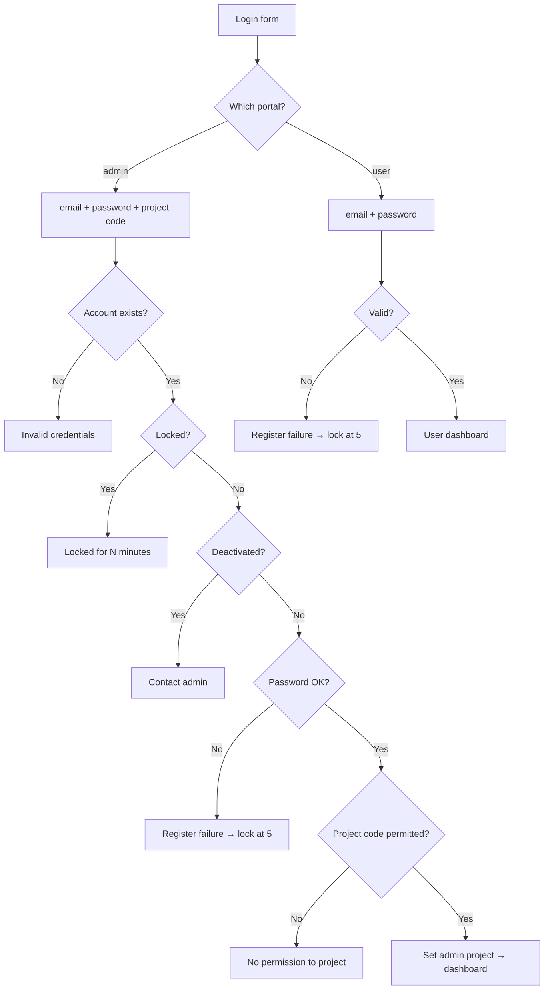
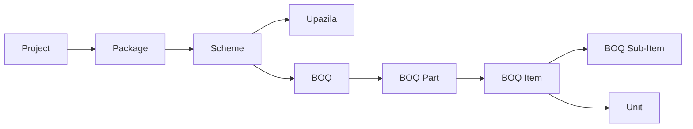
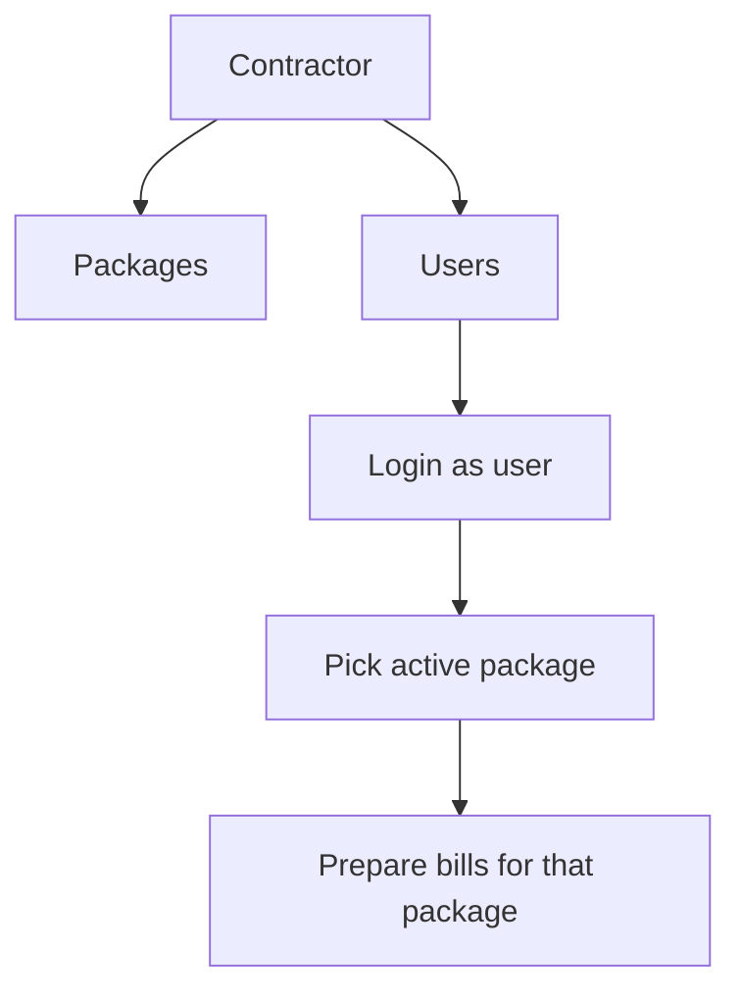
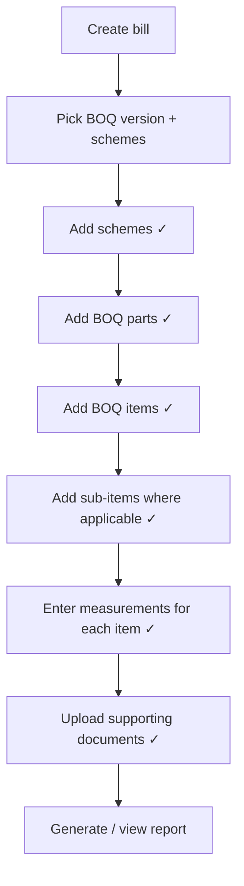
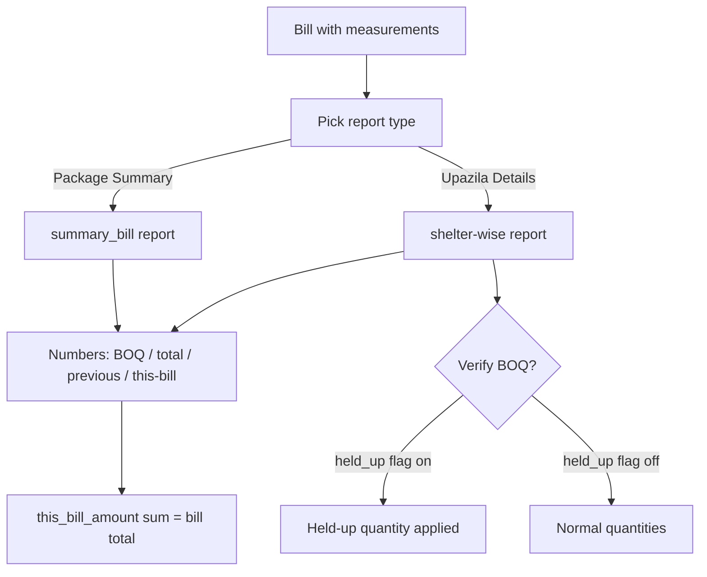
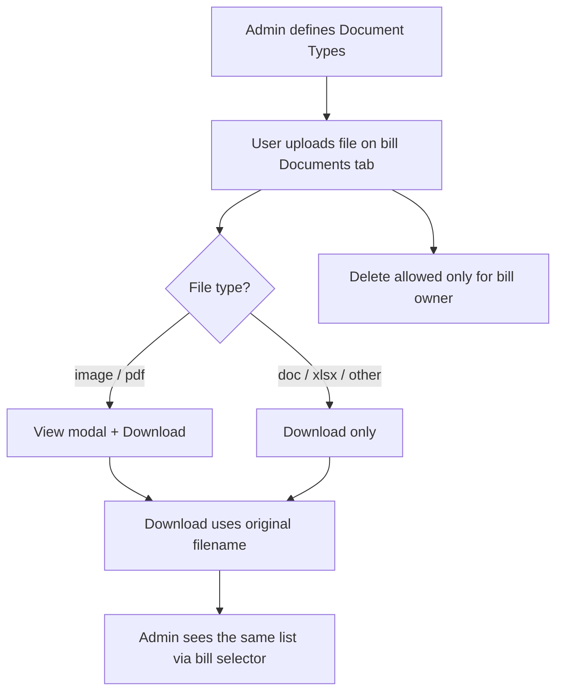

# FCPMS — Project Feature List

> Summary + details of every feature in the system, with flow charts (Mermaid).
> Companion to [`PROJECT_DOCUMENTATION.md`](./PROJECT_DOCUMENTATION.md).

---

## 1. Summary

**FCPMS** is a Laravel 12 + PostgreSQL system for managing post-disaster reconstruction programs. It runs **two separate portals**:

| Portal | URL | Users | Core job |
|--------|-----|-------|----------|
| **Admin** | `/admin/login` | Programme administrators | Configure everything (projects, packages, schemes, BOQ, contractors) and review bills / reports |
| **User (contractor)** | `/user/login` | Contractor staff | Select a package and prepare contractor bills (schemes → BOQ → measurements → documents → printable report) |

### Feature summary table

| Area | Feature | Side | Status |
|------|---------|------|--------|
| Security | Dual-guard login (admin + web) | Both | ✅ |
| Security | Admin multi-project login (project code selection) | Admin | ✅ |
| Security | Login rate limiting (`throttle:login`) | Both | ✅ |
| Security | Account lock after 5 failed attempts (15 min) | Both | ✅ |
| Security | Admin unlock / activate-deactivate contractor users | Admin | ✅ |
| Setup | Regions / divisions / districts / upazilas / unions cascading config | Admin | ✅ |
| Setup | Projects CRUD | Admin | ✅ |
| Setup | Packages CRUD (with BOQ type, dates, budgets, contract title) | Admin | ✅ |
| Setup | Scheme options CRUD | Admin | ✅ |
| Setup | Schemes CRUD (shelters, geo-location) | Admin | ✅ |
| Setup | Units CRUD | Admin | ✅ |
| BOQ | BOQ parts / items / sub-items CRUD | Admin | ✅ |
| BOQ | BOQ versions + version details (with copy) | Admin | ✅ |
| BOQ | BOQ version export / import (Excel) | Admin | ✅ |
| Contractor | Contractor CRUD + bank information | Admin | ✅ |
| Contractor | Assign packages & create contractor users | Admin | ✅ |
| Documents | Document types (admin) + file uploads per bill (user) | Both | ✅ |
| Bills (user) | Bill CRUD with target/actual physical progress | User | ✅ |
| Bills (user) | Bill detail tabs: Scheme → BOQ Part → BOQ Item → Sub Item → Measurement → Documents | User | ✅ |
| Bills (user) | Measurement recording + unit-wise view | User | ✅ |
| Bills | Bill generation / regenerate (amounts, held-up, serial) | Both | ✅ |
| Reports | Package Summary & Upazila-Details shelter-wise reports (printable) | Both | ✅ |
| Dashboard | Admin dashboard (stats, trends, top contractors) | Admin | ✅ |
| Dashboard | User dashboard (bills, amounts, monthly trends) | User | ✅ |

---

## 2. Detailed Features

### 2.1 Authentication & Security

#### Admin login (`LoginController@admin_login_post`)
1. Validates `email`, `password`, and **`project_code`**.
2. Finds the admin by email → locked? → deactivated? are checked with specific error messages.
3. On credentials match, the chosen `project_code` is matched against admin's attached projects (case-insensitive).
4. On success: the admin's `project_id`/`project_code` columns are updated and the session proceeds.
5. On failure: `LoginThrottle::registerFailure()`; **5 failed attempts → 15-minute lock**.

#### User (contractor) login (`LoginController@user_login_post`)
1. Validates `email` + `password`.
2. Looks up the user → locked? → deactivated? checked.
3. On success resets the attempt counter; on failure registers a failure and may lock the account.

**Shared protections**
- `throttle:login` (named limiter) on both login POST routes → extra IP-based rate limiting.
- Lock policy constants in `app/Helper/LoginThrottle.php`: `MAX_ATTEMPTS = 5`, `LOCK_MINUTES = 15`. Columns `login_attempts`, `locked_until`, `is_active` exist on both `users` and `admins`.

#### Admin can unlock / toggle user accounts (`ContractorUserController`)
- `POST /admin/contractor-users/{id}/unlock` — clears lock counters.
- `POST /admin/contractor-users/{id}/toggle-active` — activate / deactivate a contractor user.



---

### 2.2 Admin — Master Data

| Module | Highlights |
|--------|-----------|
| **Regions** | CRUD |
| **Projects** | CRUD, active flag; projects carry a unique code used in admin login |
| **Packages** | CRUD; fields include BOQ type (`NONEGP`/`EGP`), alias, division/region/district, bid dates, planned/actual start-end dates, planned/actual budget, description, **contract title**, active flag; admin permission scoping via `PermittedPackage` |
| **Scheme Options** | CRUD (option variations used for EGP parts) |
| **Units** | CRUD (measurement units attached to BOQ items / sub-items) |
| **Schemes** | CRUD; each scheme belongs to a package + district/upazila/union, may carry an option variation |
| **Document Types** | CRUD (admin); types are project-scoped, active flag, `name`/`description`; protected from delete while documents reference them |

**Cascading geo-lookup AJAX** (`routes` under `/common/`):
`division → district → upazila → union` and `boq part → boq item → boq sub-item → unit`.



---

### 2.3 Admin — BOQ Management

- **BOQ parts / items / sub-items**: hierarchical CRUD (quick add via cascading AJAX selects).
- **BOQ versions**: CRUD; contains one or many **version details** (the actual rates/quantities per item/sub-item).
- **Copy**: `BOQ Version Details copy` duplicates an existing version's details into a new version.
- **Export / Import**: Excel export of a version and import of new versions (`BoqVersionExportImportController`), plus `boq-versions/export` and `export-data` routes.
- Parts are BOQ-type aware: EGP parts (`has_option_variation`, EGP/NONEGP) behave differently in the shelter report.

---

### 2.4 Admin — Contractors & Users

- **Contractor CRUD**: company info (name, email, phone, reg code, website, contact person, address) + **bank information** (account no, bank name, branch, routing number, bank address).
- **Assign packages**: `admin.contractors.add_package` — attach one or multiple packages to a contractor (scoped to the admin's project).
- **Create users**: `admin.contractors.add_user` — creates login accounts for contractor staff (name, email, phone, password). Each user is tied to `contractor_id`, `project_id`, and `package_id` (defaults to the contractor's first package).



---

### 2.5 User (Contractor) — Package Selection

- Home page loads only the packages permitted to the logged-in user.
- `GET /get-permitted-packages` + `POST /select-package` → the user's working `package_id` is set; every bill thereafter is scoped to that package (plus the user's `contractor_id` + `project_id`).

---

### 2.6 User — Bills

**Bill creation** (`BillController@store`):
- Fields: bill no, bill date (required), reference code, name (required), measurement from/to dates, **physical target progress (%)**, **physical actual progress (%)**, remarks, BOQ version, one or more schemes.

**Bill index page** shows per bill:
- Name, BOQ version, bill date, status
- **Target progress %**, **Actual progress %**
- **Total this-bill amount** — `SUM(bill_details.this_bill_amount)`, right-aligned (computed via `withSum`, matches the printed report grand total)

**Bill detail tabs** (top nav, e.g. `show_scheme` … `show_documents`):

| Tab | Purpose |
|-----|---------|
| Scheme | Add/remove schemes attached to the bill |
| BOQ Part | Add/remove BOQ parts (per scheme) |
| BOQ Item | Add/remove BOQ items (per scheme + part) |
| BOQ Sub-Item | Add/remove BOQ sub-items (per scheme + part + item) |
| Measurement | Record measurements (with details), remove them, unit-wise view, held-up quantity |
| Documents | Upload / view / download / delete documents |



---

### 2.7 Measurements

- `storeMeasurement` validates part/items/sub-items, quantities, unit, **rate**, and held-up quantity; stores into `bill_details` (quantity, previous detail, BOQ quantity, held-up, `this_bill_quantity`, rate, amount, `this_bill_amount`).
- `unitWiseView` + `getMeasurementSuggestions` give a unit-by-unit breakdown and suggestions while typing.
- Measurements roll into the bill through `BillGenerator`.

---

### 2.8 Bill Generation & Reports

**`BillGenerator` (`app/Helper/BillGenerator.php`)** is the core engine:
1. Reads the current bill + all previous bill ids in the same project/package (by serial).
2. Loads schemes (from bill + previous bills) and the BOQ version.
3. For each scheme builds a **summary_bill** tree of parts → items → sub-items, comparing **BOQ quantity**, **total quantity**, **previous quantity**, and **this-bill quantity**.
4. Amounts derive from `quantity × rate`; `this_bill_amount = this_bill_quantity × rate`.
5. Renders one of:
   - **Package Summary** (`PKG_SUM`)
   - **Upazila Details** (`UPZ_DTL`) — the *shelter-wise* report (`backend/bill/shelter_bill`)

**Held-up status** (`heldUpStatus`): toggling a bill's `calculate_with_heldup` flag re-runs `BillGenerator::regenerate()`.



---

### 2.9 Documents

- **Admin**: manages `Document Types` (project-scoped, active).
- **User**: on the Documents tab of a bill, uploads one file at a time (pdf/jpg/jpeg/png/doc/docx/xls/xlsx, ≤ 20 MB). Files are stored at:
  `storage/app/public/bill_documents/{project_code}/{package_name}/{bill_no}/`
- **Viewing rules** (identical on admin + user sides):
  - Previewable (`image/*`, pdf) → **View** + **Download**
  - Not previewable (doc/docx/xls/xlsx, etc.) → **Download** only
  - Download always uses the **original filename** (`download="{{ $document->original_name }}"`).
- **Delete**: only the owning contractor user may delete a document (ownership = same contractor/project/package as the bill); the physical file is removed from disk too.
- **Admin documents view**: selecting a bill in the admin bills page loads the document list (AJAX) below the form with the same View/Download behaviour.
- Symlink `public/storage → storage/app/public` must exist (`php artisan storage:link`).



---

### 2.10 Dashboards

**Admin dashboard** (`AdminHomeController@index`) — counts projects/packages/schemes/contractors/bills/BOQ versions, **total bill amount** (sum of `this_bill_amount`), bills by status, 12-month bill count & amount trends, package scheme stats, top contractors, recent bills.

**User dashboard** (`UserHomeController@index`) — bill counts (total/draft), total billed amount, schemes covered, and monthly bill trend for the logged-in contractor's project/package.

---

## 3. Data Model (core chain)

```
projects (admin can belong to many via admin_project)
  └─ packages (belong to a project; admin_packages pivot = admin permission)
       ├─ schemes (shelters; district/upazila/union)
       ├─ boq_versions → boq_version_details (rates/qty)
       │    └─ boq_parts → boq_items → boq_sub_items
       ├─ contractors → contractor_packages (pivot w/ project)
       │    └─ users (login accounts) → bills
       └─ bills
             ├─ bill_schemes (pivot)
             ├─ bill_parts / bill_items / bill_sub_items
             ├─ bill_details (quantity, rate, this_bill_amount, held-up)
             ├─ measurements → measurements_details
             └─ bill_documents (file_path, type, uploaded_by)
```

---

## 4. Full route map (reference)

- **Admin** (`/admin`, guard `admin`): regions, projects, packages, scheme-options, document-types, schemes, units, boq-parts / boq-items / boq-sub-items, boq-versions (+details copy/export/import), contractors (+add-package/add-user), contractor-users, bills (shelter-wise view, held-up status, documents).
- **Common AJAX** (`/common`): districts-by-division, upazilas-by-district, unions-by-upazila, boq-items-by-part, boq-sub-items-by-item, boq-versions-by-package, units-by-item/sub-item, bill-boq-parts-by-scheme, bill-boq-items-by-part.
- **User** (`/`, guard `web`): bills CRUD, bill detail tabs, measurements, unit-wise view, shelter-wise view, report, regenerate, package selection, document upload/delete.

---

## 5. Environment notes

- PHP `^8.2` required (Composer platform check enforces it — CLI must not be PHP 7.x).
- PostgreSQL is required (`pgsql` driver, `gen_random_uuid()` default PKs).
- Run `php artisan storage:link` for document uploads to be reachable.
- `config/app.php` `timezone` controls dates; `bill_date` is stored as a string in places — wrap with `Carbon::parse()` when needed.