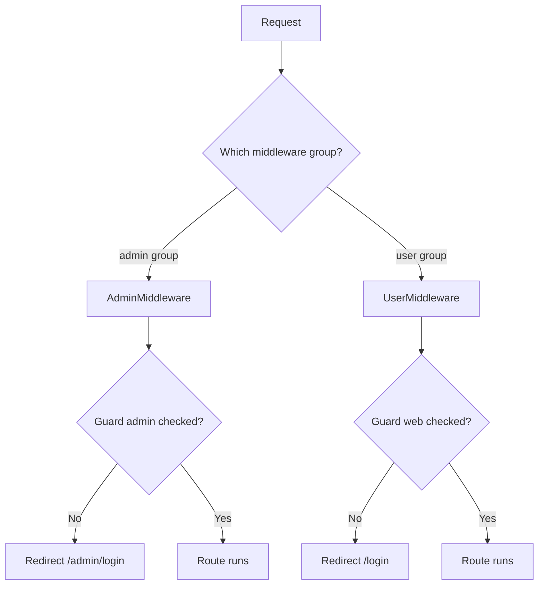
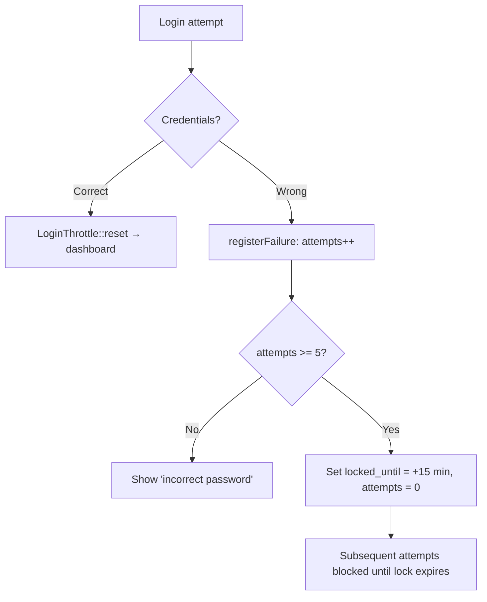

# FCPMS — Security Documentation

> What security features are implemented in the project, how they work, and what is still recommended.
> Applies to both the **Admin** (`/admin`) and **User (contractor)** (`/`) portals.

---

## 1. Summary of implemented controls

| # | Control | Where | Status |
|---|---------|-------|--------|
| 1 | Multi-guard authentication (admin + web) | `config/auth.php`, `LoginController` | ✅ |
| 2 | Login rate limiting (IP + email) | `AppServiceProvider`, `routes/web.php` | ✅ |
| 3 | Account lockout after 5 failed attempts (15 min) | `app/Helper/LoginThrottle.php` | ✅ |
| 4 | Account deactivation (disabled users/admins cannot log in) | `users.is_active`, `admins.is_active` + `LoginController` | ✅ |
| 5 | Admin-managed unlock / activate-deactivate | `ContractorUserController` | ✅ |
| 6 | CSRF protection (session tokens) | Laravel default → all POST/DELETE forms (`@csrf`) + AJAX token headers | ✅ |
| 7 | Password hashing (never stored in plain text) | `Hash::make()` in `ContractorUserController::store_user` | ✅ |
| 8 | Server-side input validation | `Validator` in every controller | ✅ |
| 9 | File-upload whitelist + size cap | `BillDocumentController::store` | ✅ |
| 10 | Owner-ship / row-level authorization | Bill scoping + document delete check | ✅ |
| 11 | Privilege separation between portals | `AdminMiddleware` / `UserMiddleware` route groups | ✅ |
| 12 | Project-scoped admin access | Project code required + permission check at admin login | ✅ |
| 13 | Protection against stored XSS in output | Blade `{{ }}` auto-escaping | ✅ |
| 14 | Atomic database operations | `DB::transaction()` for bill create/update, held-up toggle | ✅ |
| 15 | Model mass-assignment protection | `$fillable` on all models | ✅ |
| 16 | Database-backed sessions | `SESSION_DRIVER=database`, `CACHE_STORE=database` (rate limiter) | ✅ |
| 17 | Failed-login telemetry for admins | `is_locked`/`login_attempts`/`locked_until` columns on `users` & `admins` | ✅ |
| 18 | Composer platform check | Requires PHP `^8.2` | ✅ |

---

## 2. Detailed descriptions

### 2.1 Multi-guard authentication
Two independent guards enforce strict separation:

| Guard | Who | Middleware alias | Redirect |
|-------|-----|------------------|----------|
| `admin` | Administrators | `admin` → `AdminMiddleware` | `/admin/login` |
| `web`  | Contractor users | `auth` → `UserMiddleware` | `/login` |

- Route groups in `routes/web.php` wrap every protected route in the correct middleware.
- `LoginController` uses `Auth::guard('admin')` / `Auth::guard('web')` explicitly — sessions for the two roles never mix.

> ⚠️ Note: `bootstrap/app.php` remaps the Laravel built-in `auth` alias to `UserMiddleware`. Any code relying on the default `auth` middleware behaviour must be reviewed.



### 2.2 Login rate limiting
- A named limiter `login` is registered in `AppServiceProvider`:
  ```php
  RateLimiter::for('login', fn ($request) =>
      Limit::perMinute(5)->by(($request->input('email') ?? '') . '|' . $request->ip()));
  ```
- Both login POST routes apply it: `throttle:login`.
- Key = email + IP → brute-force is throttled per-account *and* per-IP.
- Runs on the database cache store (`CACHE_STORE=database`), so it works across requests/processes.

### 2.3 Account lockout (`LoginThrottle`)
- Constants: `MAX_ATTEMPTS = 5`, `LOCK_MINUTES = 15`.
- `registerFailure()` increments `login_attempts`; at the threshold it sets `locked_until = now + 15 min` and resets the counter.
- `isLocked()` treats an expired lock as unlocked; `lockMinutesRemaining()` gives the exact message time.
- `reset()` clears counters on successful login.
- Applied to **both** user and admin login paths, with specific user-facing messages.



### 2.4 Account deactivation
- `users.is_active` and `admins.is_active` gate login in `LoginController`:
  ```php
  if (!$user->is_active) return redirect()->back()->with('error', 'Your account is deactivated. Please contact admin.');
  ```
- Deactivated accounts can never authenticate, even with a correct password.

### 2.5 Admin-managed user control (`ContractorUserController`)
- `POST /admin/contractor-users/{id}/unlock` — clears `login_attempts` / `locked_until`.
- `POST /admin/contractor-users/{id}/toggle-active` — activate / deactivate a contractor user.
- Buttons on the admin user-list page (`backend/admin/users/index.blade.php`).

### 2.6 CSRF protection
- Laravel's CSRF middleware (`web` group) protects every state-changing route.
- Blade forms include `@csrf`; AJAX delete calls send `_token` (e.g. `show_documents`, bill delete, held-up toggle).

### 2.7 Password hashing
- Contractor user creation hashes the password before storing:
  ```php
  $userData['password'] = Hash::make($userData['password']);
  ```
- Uses Laravel's default bcrypt; no plaintext passwords are ever persisted.
- Minimum length enforced: `required|string|min:8`.

### 2.8 Server-side input validation
Every write controller validates before persisting, e.g.:
- `LoginController`: `email|required|email`, `password|required`.
- `PackageController` / `ContractorController` / `BillController`:
  `string|numeric|between:0,100|date|uuid|exists:packages,id|email|max:N` etc.
- `BillDocumentController`: type + size rules (below).

### 2.9 File-upload security
```php
'file' => 'required|file|mimes:pdf,jpg,jpeg,png,doc,docx,xls,xlsx|max:20480' // 20 MB
```
- Whitelisted extensions only → arbitrary code / images cannot be uploaded as scripts.
- Files are saved under `storage/app/public/bill_documents/{project}/{package}/{bill}/` (outside webroot; served via the `storage` symlink).
- Uploaded file is stored using an auto-generated name (original name kept only as metadata), preventing path-traversal via user-controlled filename.
- Max 20 MB enforced on the server.

### 2.10 Ownership / row-level authorization
- **Bills** are always scoped to the authenticated contractor's own `contractor_id`, `project_id`, `package_id`:
  ```php
  $bill = Bill::where('contractor_id', ...)->where('project_id', ...)->where('package_id', ...)->findOrFail($id);
  ```
- **Document delete** re-verifies ownership server-side (`BillDocumentController::destroy`): a user can only delete a document whose bill matches their own contractor/project/package; otherwise `403`.
- Admin operations additionally go through `PermittedPackage` / `PermittedScheme` scoping.

### 2.11 Admin project-scoped access
- Admin must supply the project code at login.
- The code is matched case-insensitively against the projects attached to that admin; a mismatch logs the admin out of the guard and denies access.
- On success the admin's current `project_id` / `project_code` is persisted — subsequent queries are naturally scoped to that project.

### 2.12 Output encoding / stored-XSS
- All dynamic output uses Blade `{{ }}` (HTML-escaped by default).
- Uploaded document metadata (title, original filename) is rendered via `{{ }}`, so malicious strings cannot execute as HTML.
- No `{!! !!}` used for user-supplied content in the documents area.

### 2.13 Atomicity
- Bill creation/update and held-up status toggling run inside `DB::transaction(...)`; if any step fails the whole change rolls back.

### 2.14 Model discipline
- All models define `$fillable` (mass-assignment protection on). UUID models set `$keyType='string'` + `$incrementing=false`, avoiding type surprises in scope checks.

### 2.15 Infrastructure notes
- `APP_ENV=local`, `APP_DEBUG=true` currently (must be `false` + `APP_ENV=production` before public deployment).
- `SESSION_DRIVER=database`, `CACHE_STORE=database`.
- Composer platform check refuses to run on PHP < 8.2.
- `storage:link` must point `public/storage → storage/app/public` for documents.

---

## 3. Recommendations (not yet implemented)

| Gap | Recommendation |
|-----|----------------|
| HTTPS | Run behind TLS; keep cookies `secure` in production (`config/session.php`). |
| Production flags | Set `APP_DEBUG=false`, `APP_ENV=production`. |
| 2FA | Consider TOTP/email 2-factor for admin accounts (highest privilege). |
| Password reset | No self-service reset exists; admin must manage accounts. |
| File virus scanning | Upladented files are only size/mime checked — consider scanning (e.g. ClamAV) for binaries. |
| Download served w/ headers | Downloads link to `/storage/...` directly; a controller route with `Content-Disposition` + `X-Content-Type-Options: nosniff` would be stricter. |
| Security headers | Add `X-Frame-Options`, `X-Content-Type-Options`, CSP via middleware or reverse proxy. |
| Rate limiting scope | Only login is throttled; consider throttling measurement/document submit endpoints. |
| Audit logs | Login failure/success and destructive actions are not logged — recommend an audit table. |

---

## 4. Verification commands

```bash
# route middleware map (confirm guards/groups)
php artisan route:list

# confirm middleware aliases
php artisan about

# clear stale caches after config/route changes
php artisan optimize:clear
```

> Note: the default shell here sometimes picks a PHP 7.x on the PATH; the project requires **PHP ^8.2** (see `composer.json`).